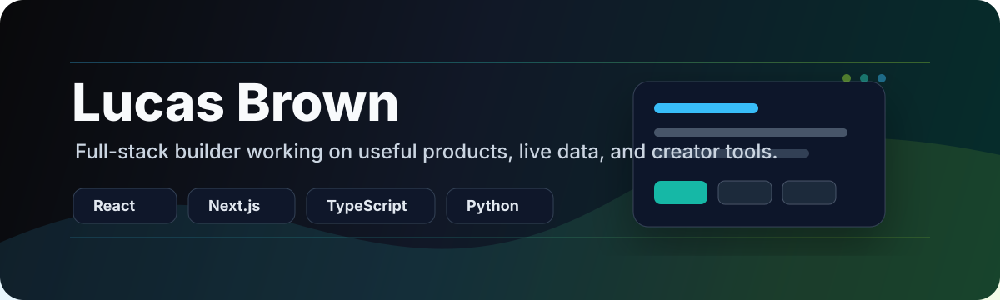

  

  

    
    
    
  

## About

I'm Lucas, a full-stack builder focused on clean interfaces, real-time features, and practical products. I like turning ideas into working software quickly, then tightening the details until the product feels sharp.

Right now I am especially interested in sports data, creator tools, internal product dashboards, and AI-assisted workflows.

## Building

<table>
  <tr>
    <td width="50%" valign="top">
      <h3>ProductDeck</h3>
      
A product and business workflow project I am developing privately.

      

        
        
      

    </td>
    <td width="50%" valign="top">
      <h3>StreamSpark</h3>
      
Real-time engagement tools for streamers, including predictions, bingo, trivia, overlays, and live viewer rooms.

      

        
        
        
      

    </td>
  </tr>
</table>

## Public Repositories

<table>
  <tr>
    <td width="50%" valign="top">
      <h3><a href="https://github.com/Browny01/SportPulseCLI">SportPulseCLI</a></h3>
      
A Python terminal UI for live sports scores, player stats, standings, timelines, and round-by-round navigation, plus a macOS menu bar app.

      

        
        
        
      

    </td>
    <td width="50%" valign="top">
      <h3><a href="https://github.com/Browny01/ultimate-naughts-and-crosses">Ultimate Naughts and Crosses</a></h3>
      
A small browser game experiment deployed on Vercel.

      

        
        
        
      

    </td>
  </tr>
</table>

## Stack

  
  
  
  
  
  
  
  

## GitHub Stats

  
  
  

## Contact

Best place to reach me is X: <a href="https://x.com/itsbrownyy">@itsbrownyy</a>.
